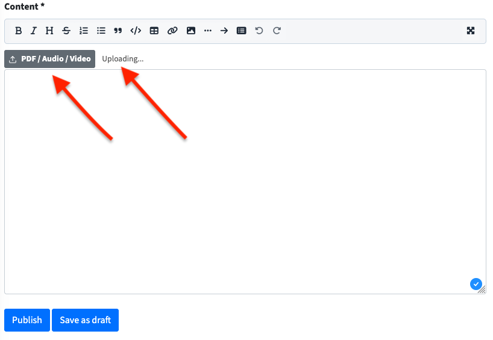
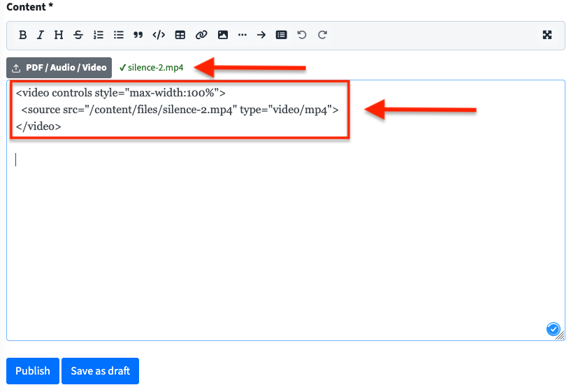

# htmly-media-upload

Native PDF, audio and video upload support for [HTMLy](https://www.htmly.com/) v3.1.1+.

Adds an upload button directly to the HTMLy post editor toolbar. Uploaded files are stored in `content/files/` and are automatically included in HTMLy's built-in backup.

---




---

## Features

- Upload **PDF**, **audio** and **video** files directly from the post editor
- Works on **desktop and mobile** browsers
- Files stored in `content/files/` — included in HTMLy backups
- Automatically inserts the correct HTML tag at cursor position:
  - PDF → `<a href="..." target="_blank">`
  - Audio → `<audio controls>`
  - Video → `<video controls>`
- Smart filename handling: keeps original filename, appends `-2`, `-3` etc. on duplicates
- Login-protected: only works when logged into HTMLy admin

## Supported formats

| Type  | Formats                        |
|-------|-------------------------------|
| PDF   | pdf                            |
| Audio | mp3, ogg, wav, aac, flac, m4a |
| Video | mp4, webm, ogv, mov            |

---

## Requirements

- HTMLy v3.1.1+
- PHP 7.2+
- Apache with mod_rewrite

---

## Installation

### 1. Upload the handler

Copy `upload-file.php` to your HTMLy **root directory** (same level as `index.php`).

### 2. Patch the editor

Open **all four** of the following files in your HTMLy installation:

```
system/admin/views/add-content.html.php
system/admin/views/edit-content.html.php
system/admin/views/add-page.html.php
system/admin/views/edit-page.html.php
```

Find this line in each file:

```html
<div id="wmd-button-bar" class="wmd-button-bar"></div>
```

Insert the entire contents of `add-content.patch.html` directly after that line.

### 3. Verify file permissions

The `content/files/` directory is created automatically on the first upload. This requires write permissions on the `content/` directory, which HTMLy already sets during installation.

If the first upload fails with `Error: Could not save file`, create the directory manually via FTP or your hosting file manager and set permissions to `755`.

---

## PHP Upload Limits

By default, PHP limits file uploads. If you get the error `File exceeds upload_max_filesize in php.ini`, you need to increase the limits on your server.

Two values must always be set together:
- `upload_max_filesize` — maximum size of a single uploaded file
- `post_max_size` — must always be slightly larger than `upload_max_filesize`

How to change these values depends on your hosting environment. **VPS and shared hosting handle this differently.** Check your hosting provider's documentation or control panel for the correct method.

You can check your current PHP limits by creating a temporary `info.php` file with `<?php phpinfo();` and opening it in your browser. Delete the file afterwards.

> **Note:** The upload limit in `upload-file.php` is set to 200 MB by default. If you increase the PHP limit, adjust the `$maxSize` variable in `upload-file.php` accordingly:
> ```php
> $maxSize = 256 * 1024 * 1024; // 256 MB
> ```

---

## Security

This plugin uses two layers of protection against malicious file uploads:

**1. Browser-side filter (`accept` attribute)**
The file picker only shows allowed file types. This is a convenience feature for the user — it is not a security measure, as it can be bypassed by selecting "All files" in the file dialog.

**2. Server-side MIME type validation**
`upload-file.php` uses PHP's `mime_content_type()` to inspect the actual file header, independent of the file extension. A renamed `.exe` file disguised as `.mp3` will be detected and rejected, because its MIME type (`application/x-executable`) is not in the allowed list.

Only files whose actual MIME type matches a known safe format are accepted and saved.

---

## Messages

| Message | Color | Description | Possible cause |
|---------|-------|-------------|----------------|
| `Uploading...` | grey | Upload in progress | — |
| `✔ filename.mp3` | green | File uploaded successfully | — |
| `Error: Not logged in` | red | Request rejected by server | Session expired, not logged into HTMLy admin |
| `Error: File too large (max. 200 MB)` | red | File exceeds size limit | File larger than 200 MB |
| `Error: File type not allowed: ...` | red | MIME type not permitted | Unsupported file format |
| `Error: Could not save file` | red | Server could not write file | Missing write permissions on `content/files/` |
| `Error: File exceeds upload_max_filesize in php.ini` | red | PHP upload limit reached | Increase `upload_max_filesize` in php.ini |
| `Error: File was only partially uploaded` | red | Upload interrupted | Network issue, try again |
| `Error: Missing temporary folder` | red | PHP temp directory missing | Server configuration issue |
| `Upload failed` | red | Request could not be completed | Network error or server unreachable |

---

## After updating HTMLy

> ⚠️ **Warning:** After updating HTMLy, check whether the patch is still in place in all four editor files:
> - `system/admin/views/add-content.html.php`
> - `system/admin/views/edit-content.html.php`
> - `system/admin/views/add-page.html.php`
> - `system/admin/views/edit-page.html.php`
>
> Also verify that `upload-file.php` is still present in the root directory.
>
> The `content/files/` directory and its contents are never touched by HTMLy updates.

---

## Changelog

### 1.0.0
- Initial release
- PDF, audio and video upload support
- Smart filename deduplication
- Auto tag insertion in Markdown editor

---

## License

GPL-2.0 — same as HTMLy.

## Note

This project was developed with the assistance of AI.
